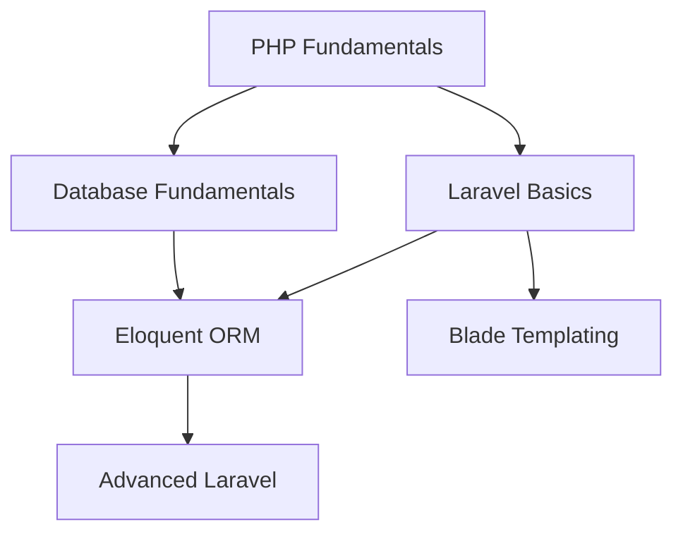

# Laravel Skill Checker - Application Improvement Roadmap

## Table of Contents
1. [Enhanced Training Types](#enhanced-training-types)
2. [Improved Scoring System](#improved-scoring-system)
3. [Skill Hierarchies & Taxonomy](#skill-hierarchies--taxonomy)
4. [RPG-Style Progression](#rpg-style-progression)
5. [Gamification Features](#gamification-features)
6. [Wellness & Cognitive Enhancement](#wellness--cognitive-enhancement)
7. [Consistency & Habits](#consistency--habits)
8. [Assessment & Validation](#assessment--validation)
9. [Learning Resources Integration](#learning-resources-integration)
10. [Social & Community Features](#social--community-features)
11. [Analytics & Insights](#analytics--insights)

---

## Enhanced Training Types

### Different Learning Modalities
Currently, training is generic. We should support specialized training types:

#### 1. **Reading/Study Sessions**
- **Additional Fields**: Pages read, source (book/article/docs), reading speed
- **Scoring**: Base on comprehension difficulty + retention rate
- **Example**: Reading Laravel documentation, technical books, blog posts

#### 2. **Video Tutorials**
- **Additional Fields**: Video length, playback speed, pause count, notes taken
- **Scoring**: Completion rate × engagement level × difficulty
- **Example**: Laracasts, YouTube tutorials, course videos

#### 3. **Hands-on Coding**
- **Additional Fields**: Lines of code, commits made, bugs fixed, features completed
- **Scoring**: Complexity × quality × time efficiency
- **Example**: Building projects, coding challenges, kata

#### 4. **Problem Solving**
- **Additional Fields**: Problem difficulty, attempts, solution quality, hints used
- **Scoring**: Difficulty multiplier × (1 - hints_used/max_hints) × time bonus
- **Example**: LeetCode, algorithm challenges, debugging

#### 5. **Teaching/Mentoring**
- **Additional Fields**: Students helped, concepts explained, feedback received
- **Scoring**: Teaching multiplier (higher score for teaching)
- **Example**: Code reviews, mentoring sessions, writing tutorials

#### 6. **Project Work**
- **Additional Fields**: Project type, technology stack, features implemented
- **Scoring**: Project complexity × feature completion × code quality
- **Example**: Personal projects, open source contributions

---

## Improved Scoring System

### Current Issues with Scoring
The current formula `RPE × 1.5 × Duration` treats all activities equally and doesn't account for:
- Learning effectiveness
- Skill difficulty
- Quality of work
- Long-term retention

### Proposed Enhanced Scoring

#### Base Formula
```
Score = (Base_Points × Difficulty_Multiplier × Quality_Factor × Efficiency_Bonus) × Retention_Multiplier
```

#### Components Breakdown

**1. Base Points**
- Reading: 1 point per 10 minutes
- Videos: 1.2 points per 10 minutes (passive learning penalty)
- Coding: 2 points per 10 minutes
- Problem Solving: 3 points per 10 minutes
- Teaching: 4 points per 10 minutes (teaching bonus)

**2. Difficulty Multiplier**
- Beginner: 1.0x
- Intermediate: 1.5x
- Advanced: 2.0x
- Expert: 3.0x

**3. Quality Factor (0.5 - 2.0)**
- Based on self-assessment of understanding
- Validated through quizzes/practical application
- Peer review scores

**4. Efficiency Bonus**
- Faster completion with same quality = bonus
- Slower completion = neutral (learning takes time)

**5. Retention Multiplier**
- Review sessions within 24 hours: 1.2x
- Practice within 1 week: 1.1x
- No follow-up: 0.9x (forgetting curve penalty)

---

## Skill Hierarchies & Taxonomy

### Skill Tree Structure

#### Core Programming Skills
- **Fundamentals**
  - Variables & Data Types
  - Control Structures
  - Functions
  - Object-Oriented Programming
  
- **Web Development**
  - HTML/CSS
  - JavaScript
  - PHP Fundamentals
  - HTTP/REST APIs

#### Laravel-Specific Skills
- **Framework Basics**
  - Routing
  - Controllers
  - Views & Blade
  - Middleware
  
- **Database & Eloquent**
  - Migrations
  - Models & Relationships
  - Query Builder
  - Eloquent Advanced

- **Advanced Laravel**
  - Service Providers
  - Events & Listeners
  - Queues & Jobs
  - Testing

#### Professional Skills
- **Development Practices**
  - Version Control (Git)
  - Testing (Unit, Feature, E2E)
  - Code Review
  - Documentation

- **DevOps & Deployment**
  - Server Management
  - CI/CD
  - Docker
  - Cloud Services

### Skill Dependencies


---

## RPG-Style Progression

### Character Profile
- **Avatar/Profile Picture**
- **Character Stats**
  - Level (overall skill)
  - Experience Points (XP)
  - Skill Points in different areas
  - Learning Streak
  - Achievements Unlocked

### Leveling System
- **Level 1-10**: Novice Developer
- **Level 11-25**: Junior Developer
- **Level 26-50**: Mid-Level Developer
- **Level 51-75**: Senior Developer
- **Level 76-100**: Expert/Architect

### XP Calculation
```
XP = Score × Skill_Rarity_Multiplier × Consistency_Bonus
```

### Skill Specializations
Players can choose specialization paths:
- **Frontend Specialist**: Bonus XP for UI/UX related skills
- **Backend Architect**: Bonus XP for server-side and database skills
- **Full-Stack Explorer**: Balanced progression across all areas
- **DevOps Engineer**: Bonus XP for deployment and infrastructure

### Equipment/Tools System
- **IDEs**: PhpStorm, VS Code (unlock features)
- **Frameworks**: Laravel, Vue.js, React (proficiency levels)
- **Libraries**: Unlock as you progress
- **Certifications**: Official Laravel certifications as "legendary items"

---

## Gamification Features

### Achievement System

#### Learning Achievements
- **First Steps**: Complete first training session
- **Consistent Learner**: 7-day learning streak
- **Marathon Reader**: Read for 4+ hours in a day
- **Code Warrior**: Complete 100 coding sessions
- **Teacher**: Help someone else learn (mentoring)

#### Skill Achievements
- **Laravel Novice**: Complete basic Laravel skills
- **Database Guru**: Master all database-related skills
- **Testing Champion**: Write comprehensive tests
- **Performance Optimizer**: Optimize slow code/queries

#### Special Achievements
- **Night Owl**: Learning sessions after 10 PM
- **Early Bird**: Learning sessions before 7 AM
- **Weekend Warrior**: Learning on weekends
- **Comeback Kid**: Return after 30+ day break

### Badge System
- **Skill Badges**: PHP, Laravel, JavaScript, CSS, etc.
- **Learning Method Badges**: Reader, Watcher, Builder, Teacher
- **Consistency Badges**: 7-day, 30-day, 100-day streaks
- **Quality Badges**: High-quality submissions, peer recognition

### Leaderboards
- **Weekly XP Leaders**
- **Monthly Skill Progress**
- **All-Time Contributors**
- **Streak Champions**
- **Skill-Specific Rankings**

---

## Wellness & Cognitive Enhancement

### The Science Behind Better Learning
Research shows that cognitive wellness activities significantly improve:
- **Focus & Concentration**: 23% improvement in sustained attention
- **Memory Retention**: 40% better recall after mindfulness practice
- **Learning Speed**: 25% faster skill acquisition
- **Stress Reduction**: Lower cortisol = better neuroplasticity
- **Creative Problem Solving**: Enhanced divergent thinking

### Wellness Activity Types

#### 1. **Mindfulness & Meditation**
Track meditation sessions that directly enhance learning capacity:

**Additional Fields**:
- Session type (focused attention, open monitoring, loving-kindness)
- Duration and quality (1-10 scale)
- Pre/post mood and energy levels
- Guided vs. unguided
- App used (Headspace, Calm, Insight Timer)

**Learning Boost Multiplier**: 
- 10+ min meditation before coding: +15% XP bonus
- Daily meditation streak: +5% to all learning activities
- Meditation immediately after learning: +10% retention bonus

#### 2. **Physical Exercise**
Physical activity boosts BDNF (brain-derived neurotrophic factor) for better learning:

**Activity Types**:
- **Cardio**: Running, cycling, swimming
- **Strength Training**: Weight lifting, bodyweight exercises
- **Yoga**: Physical + mindfulness combination
- **Walking**: Simple but effective for creative thinking

**Learning Integration**:
- Post-exercise learning: +20% XP bonus (endorphin boost)
- Walking meetings/learning: +10% creativity bonus
- Exercise → coding sessions: Enhanced problem-solving

#### 3. **Sleep Quality Tracking**
Sleep is crucial for memory consolidation and learning:

**Tracking Metrics**:
- Hours of sleep
- Sleep quality (subjective 1-10)
- Sleep consistency (same bedtime/wake time)
- Pre-sleep screen time
- Caffeine cutoff time

**Learning Impact**:
- 7-9 hours quality sleep: Normal XP rates
- <6 hours sleep: -25% XP penalty (impaired learning)
- >9 hours: +10% XP bonus (well-rested bonus)
- Consistent sleep schedule: Streak multiplier

#### 4. **Nutrition & Hydration**
Brain fuel affects cognitive performance:

**Tracking Elements**:
- Water intake (glasses per day)
- Brain-healthy foods (fish, nuts, berries, leafy greens)
- Caffeine timing and amount
- Meal timing relative to learning sessions

**Performance Impact**:
- Proper hydration: +5% focus bonus
- Brain-healthy meal before learning: +10% retention
- Intermittent fasting periods: +15% mental clarity
- Post-meal learning (avoid food coma): Time-based penalties

#### 5. **Digital Detox & Deep Work**
Managing attention and reducing cognitive load:

**Activities**:
- Phone-free learning sessions
- Social media breaks
- Deep work blocks (2+ hours uninterrupted)
- Digital sabbath (device-free time)

**Attention Rewards**:
- Phone-free coding: +25% XP bonus
- Deep work sessions: Exponential XP growth over time
- Notification-free learning: +15% quality bonus

#### 6. **Breathing Exercises**
Quick cognitive reset and stress management:

**Techniques**:
- Box breathing (4-4-4-4)
- 4-7-8 relaxation breathing
- Wim Hof method
- Alternate nostril breathing

**Quick Boost System**:
- 2-minute breathing before difficult tasks: +10% problem-solving
- Stress reset during debugging: Restore focus meter
- Pre-presentation breathing: Reduce anxiety, improve clarity

### Wellness Scoring & Integration

#### Wellness Score Formula
```
Daily_Wellness_Score = (
    Meditation_Points + 
    Exercise_Points + 
    Sleep_Quality * 10 + 
    Nutrition_Score + 
    Digital_Wellness_Points
) / 5
```

#### Learning Multiplier
```
Learning_Multiplier = 1.0 + (Daily_Wellness_Score - 50) / 100
```
- Wellness Score 0-30: 0.7x-0.85x learning multiplier
- Wellness Score 50: 1.0x (neutral)
- Wellness Score 70-100: 1.2x-1.5x learning multiplier

### Wellness Achievements & Badges

#### Meditation Achievements
- **Zen Coder**: 30-day meditation streak
- **Mindful Programmer**: Meditate before 100 coding sessions
- **Deep Thinker**: Complete 10+ hour meditation challenges

#### Fitness Achievements
- **Active Learner**: Exercise + learn same day for 30 days
- **Runner's High**: Code within 2 hours of cardio 50 times
- **Yoga Warrior**: Combine yoga + programming sessions

#### Sleep Achievements
- **Well Rested**: 7+ nights quality sleep streak
- **Sleep Optimizer**: Consistent bedtime for 30 days
- **Dream Coder**: Learn something new every day for a month

#### Holistic Achievements
- **Wellness Warrior**: High wellness score for 30 days
- **Balanced Developer**: Equal focus on code and wellness
- **Life Optimizer**: Master all wellness categories

### Smart Integrations

#### Wearable Device Sync
- **Fitness Trackers**: Auto-import exercise and sleep data
- **Smartwatches**: Heart rate during learning, stress monitoring
- **Sleep Devices**: Oura Ring, sleep cycle apps integration

#### App Integrations
- **Meditation Apps**: Headspace, Calm, Insight Timer
- **Fitness Apps**: Strava, MyFitnessPal, Apple Health
- **Sleep Apps**: Sleep Cycle, Pillow, AutoSleep

#### Environmental Optimization
- **Learning Environment Checklist**:
  - Proper lighting (natural vs. artificial)
  - Temperature control (68-72°F optimal)
  - Noise levels and background sounds
  - Desk ergonomics and posture
  - Air quality and plants

### Wellness-Enhanced Learning Sessions

#### Pre-Learning Rituals
**Quick Boost (5 minutes)**:
1. 2-minute breathing exercise
2. Hydration check
3. Posture adjustment
4. Intention setting

**Power Preparation (15 minutes)**:
1. 10-minute meditation
2. Light stretching/movement
3. Brain-healthy snack
4. Environment optimization
5. Goal setting for session

#### During-Learning Optimization
- **Pomodoro + Wellness**: 25-min focus + 5-min breathing/movement
- **Hydration Reminders**: Drink water every 45 minutes
- **Posture Checks**: Automated reminders to adjust position
- **Eye Rest**: 20-20-20 rule (every 20 min, look 20 feet away for 20 seconds)

#### Post-Learning Integration
- **Reflection Meditation**: Process what was learned
- **Gratitude Practice**: Appreciate progress made
- **Physical Movement**: Celebrate with movement
- **Knowledge Consolidation**: Quick review + sleep preparation

### Wellness Coaching Features

#### Personalized Recommendations
- **Energy Pattern Analysis**: Best learning times based on wellness data
- **Stress Intervention**: Suggested wellness activities during high-stress periods
- **Recovery Optimization**: Tailored rest recommendations
- **Performance Correlation**: Which wellness activities most improve your learning

#### Wellness Challenges
- **30-Day Meditation Challenge**: Build consistency
- **Fitness + Code Challenge**: Exercise before every coding session
- **Digital Detox Week**: Phone-free learning periods
- **Sleep Optimization Month**: Perfect sleep hygiene

#### Community Wellness
- **Wellness Buddies**: Partner accountability for health habits
- **Group Challenges**: Team meditation sessions, fitness competitions
- **Wellness Sharing**: Tips and experiences from community
- **Expert Content**: Interviews with wellness experts for developers

### Integration with Existing Features

#### Enhanced RPG Elements
- **Wellness Stats**: Add health, energy, focus as character attributes
- **Wellness Equipment**: Meditation cushions, fitness gear, sleep optimization tools
- **Wellness Skills**: Meditation mastery, fitness consistency, sleep optimization

#### Improved Scoring System
```
Final_Score = Base_Learning_Score × Wellness_Multiplier × Consistency_Bonus
```

#### Smart Scheduling
- **Optimal Learning Windows**: Based on sleep, exercise, and energy patterns
- **Wellness-Informed Breaks**: Suggest meditation vs. movement based on current state
- **Recovery Recommendations**: When to push vs. when to rest

### Scientific Backing Integration

#### Research Citations
- Display relevant research about wellness impact on learning
- Weekly "Wellness Science" tips
- Evidence-based recommendations personalized to user data

#### Biometric Tracking
- **Heart Rate Variability**: Stress and recovery monitoring
- **Cortisol Patterns**: Morning energy optimization
- **Focus Metrics**: Attention span tracking during learning sessions

This comprehensive wellness integration transforms the app from just a skill tracker to a holistic developer growth platform that optimizes both learning and wellbeing!

---

## Consistency & Habits

### Streak System
- **Learning Streaks**: Consecutive days with training
- **Skill Streaks**: Consecutive practice in specific skills
- **Quality Streaks**: Maintaining high-quality scores

### Habit Formation
- **Daily Goals**: Minimum XP targets
- **Weekly Challenges**: Specific skill focus
- **Monthly Themes**: Laravel month, JavaScript month, etc.

### Streak Recovery
- **Streak Freeze**: Use earned "freeze tokens"
- **Weekend Buffer**: Weekends don't break streaks
- **Makeup Sessions**: Double XP for recovery days

### Chain Consistency Features
- **Visual Progress Chains**: GitHub-style contribution graph
- **Streak Multipliers**: Longer streaks = higher XP multipliers
- **Milestone Rewards**: Special rewards at 30, 100, 365 days

---

## Assessment & Validation

### Skill Validation
Instead of just self-reported progress, add validation:

#### Micro-Assessments
- **Quick Quizzes**: 3-5 questions after learning sessions
- **Code Challenges**: Small coding tasks to validate understanding
- **Peer Review**: Submit code for community feedback

#### Practical Projects
- **Guided Projects**: Step-by-step projects with validation
- **Portfolio Pieces**: Substantial projects showcasing skills
- **Real-World Challenges**: Simulated client requirements

#### Certification Tracks
- **Internal Certifications**: Platform-specific skill validation
- **Preparation Paths**: For official Laravel certification
- **Industry Standards**: Align with recognized skill frameworks

---

## Learning Resources Integration

### Built-in Learning Hub
- **Curated Content**: Links to best resources for each skill
- **Interactive Tutorials**: Step-by-step guides with validation
- **Code Sandbox**: Practice environment integrated into platform

### External Resource Tracking
- **Bookmark System**: Save and organize learning resources
- **Progress Sync**: Track progress on external platforms
- **Recommendation Engine**: AI-powered content suggestions

### Community Contributions
- **User-Generated Content**: Community tutorials and guides
- **Resource Reviews**: Rate and review learning materials
- **Study Groups**: Collaborative learning sessions

---

## Social & Community Features

### Learning Together
- **Study Buddies**: Pair users for mutual accountability
- **Learning Groups**: Join groups focused on specific skills
- **Mentorship Program**: Connect experienced developers with learners

### Knowledge Sharing
- **Developer Blogs**: Share learning experiences
- **Code Showcases**: Display projects and get feedback
- **Tips & Tricks**: Quick knowledge sharing

### Competitions
- **Coding Challenges**: Weekly/monthly competitions
- **Learning Sprints**: Group challenges with shared goals
- **Hackathons**: Virtual events for portfolio building

---

## Analytics & Insights

### Personal Analytics
- **Learning Velocity**: Track improvement rate over time
- **Skill Radar Chart**: Visual representation of skill levels
- **Time Investment**: Where you spend your learning time
- **Efficiency Metrics**: Learning effectiveness analysis

### Predictive Insights
- **Career Path Recommendations**: Based on current skills and goals
- **Learning Schedule Optimization**: Best times for effective learning
- **Skill Gap Analysis**: What to learn next for career goals

### Comparative Analytics
- **Peer Comparison**: How you compare to similar learners
- **Industry Benchmarks**: Skills needed for specific roles
- **Market Trends**: Popular skills and technologies

---

## Implementation Phases

### Phase 1: Foundation (Current + Enhanced Scoring)
- Implement enhanced scoring system
- Add basic skill categories
- Create achievement framework

### Phase 2: Gamification Core
- RPG-style progression system
- Basic badge and achievement system
- Streak tracking and consistency features

### Phase 3: Specialized Training Types
- Different training modalities
- Validation and assessment features
- Learning resource integration

### Phase 4: Community & Social
- Social features and community building
- Mentorship programs
- Competitions and challenges

### Phase 5: Advanced Analytics
- Predictive analytics
- Career path recommendations
- AI-powered personalization

---

## Technical Considerations

### Database Schema Updates
- Enhanced training types with polymorphic relationships
- Achievement and badge tracking tables
- Social features (friendships, groups, etc.)
- Analytics and metrics storage

### API Design
- RESTful APIs for mobile app development
- Integration with external learning platforms
- Real-time features for competitions and social interactions

### Performance Optimization
- Caching for leaderboards and analytics
- Queue jobs for heavy computations
- Efficient database queries for large datasets

---

## Conclusion

This roadmap transforms a simple training tracker into a comprehensive skill development platform that:
- **Motivates** through gamification and social features
- **Validates** learning through assessments and practical application
- **Guides** learners through structured skill progression
- **Connects** developers in a supportive community
- **Adapts** to individual learning styles and career goals

The key is implementing these features incrementally, starting with the most impactful improvements to the scoring system and gamification features, then expanding into specialized training types and community features.